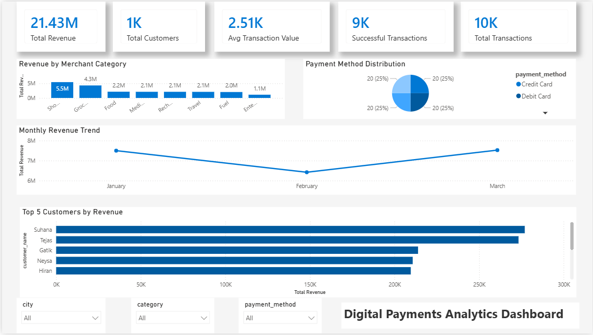

# GitHub Repository Setup Details

## 📝 Repository Name
```
digital-payments-analytics
```

## 📄 Repository Description (160 chars max)
```
End-to-end Digital Payments Analytics using Snowflake SQL & Power BI | 30+ SQL queries, Customer Segmentation, Revenue Analysis & Interactive Dashboard
```

## 🏷️ Topics / Tags (add these in GitHub)
```
sql
snowflake
powerbi
data-analytics
business-intelligence
dax
data-visualization
customer-segmentation
revenue-analysis
window-functions
cte
data-analysis-project
```

## ✅ GitHub Repo Checklist
- [ ] Create repo as **Public**
- [ ] Add README.md (provided)
- [ ] Add Description (above)
- [ ] Add Topics/Tags (above)
- [ ] Upload SQL files in `/sql` folder
- [ ] Upload Power BI `.pbix` file in `/powerbi` folder
- [ ] Upload CSV datasets in `/data` folder (optional — or mention in README that data is sample)
- [ ] Add a dashboard screenshot as `dashboard.png` and reference it in README

## 💡 Pro Tip — Add Screenshot to README
After uploading your dashboard screenshot, add this line below the Power BI section in README:

```markdown

```
